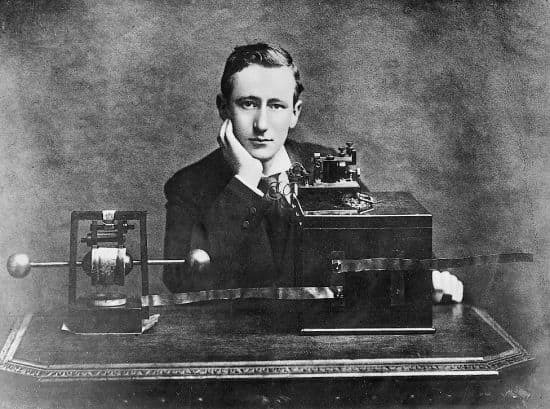
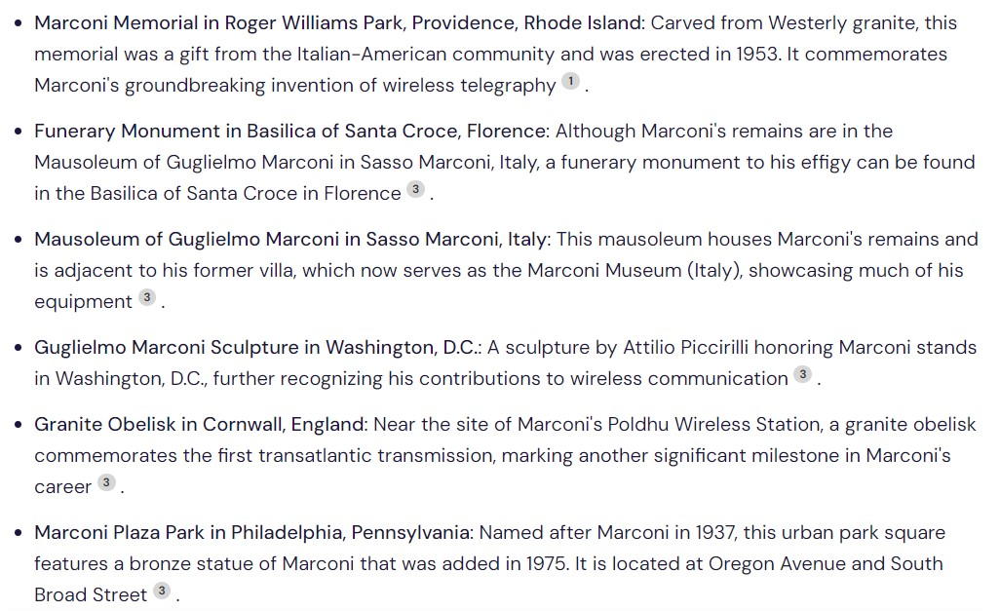

### No bluff here

https://www.adventofosint.com/en/2023/12

## Task

  

This man achieved a world first that earned him the Nobel Prize a few years later.  
1. Which letter was sent this day ?
Today, in one of the two places chosen for this event, we can find an obelisk.  
On it, there's at least two different plaques : one recalls the message previously found and the other one names, in single quotes, a means of transport.  
2. What should the name have been if it had been easier to pronounce in English?  
(Example: x alberta)

## Solution

1. You can easily find this [guy](https://en.wikipedia.org/wiki/Guglielmo_Marconi) using the google image search.  
2. It looks like he got a Nobel Prize in Physics in 1909.  
3. https://cylect.io/ comes in handy once again as it helps us find the [letter](https://www.history.com/this-day-in-history/marconi-sends-first-atlantic-wireless-transmission).
    > What was a letter Marconi sent using telegraph?
  
4. There is a bnch of monuments out there...  
  
5. After checking some of them we come accross the [Poldhu one]((https://commons.wikimedia.org/wiki/File:Marconi_monument_at_Poldhu_%287970%29.jpg)).  
6. It mentiones the [Yacht](https://en.wikipedia.org/wiki/Elettra_(1904_ship)), however it's name doesn't solve the riddle neither in Italian, English nor French.   
7. The Wikipedia page mentiones the yacht was supposed to have the different name, however it was proven too difficult to pronounce in English.

Answer
s Scintilla

Keyword
Doudoune en mousse
